# Expense Tracking Application

This web application created using Dango Framework is an application to help individuals track their expenses with insightful visualizations. 
It uses of the MVT (Model View Template) architecture of Django framework. For the frontend, it uses HTML, CSS, and Javascript. The data is stored in the MySQL local server and can be managed by the admin site also.

The MVT Architecture is a software design pattern used by the Django Framework to create web applications. It determines the total structure and workflow of a Django application. It separates the logic and the output of the application.

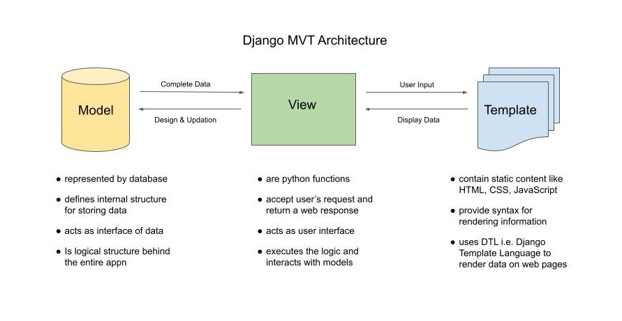

Following is the Simple UML Diagram for the Application.

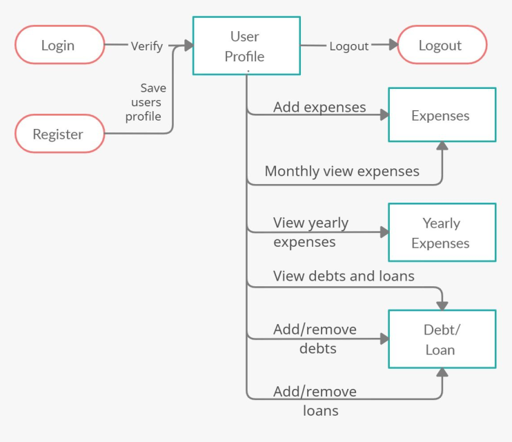

The ER Diagram for the Database shows different entities and types of relationships among them used in the application.

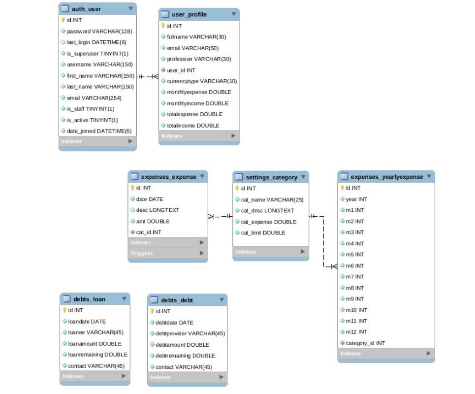

Below are some of the stills from the application. The aim was to provide a clean minimalistic UI, requiring little effort from the user in entering input, showing insightful visualizations to users helping them to monitor their spending habits. The application provides the following functionalities to the user- 
1) Register/ Login
2) Add / Delete Expenses
4) View Monthly and Yearly Expenditure
3) Add / Delete loans taken, debts provided.
5) Add / Delete an expense Category

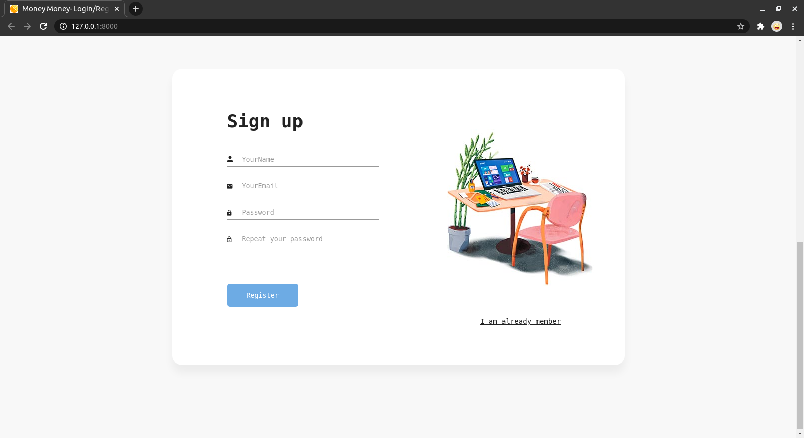
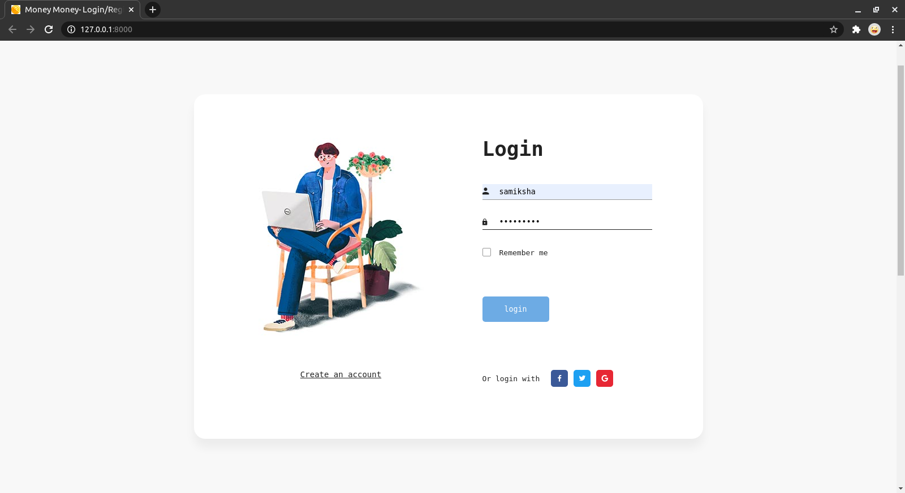
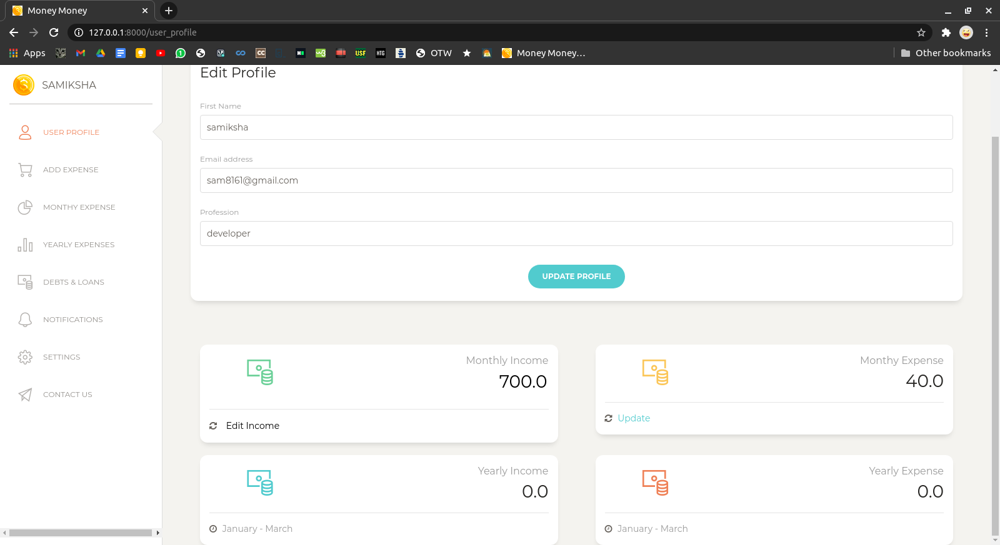
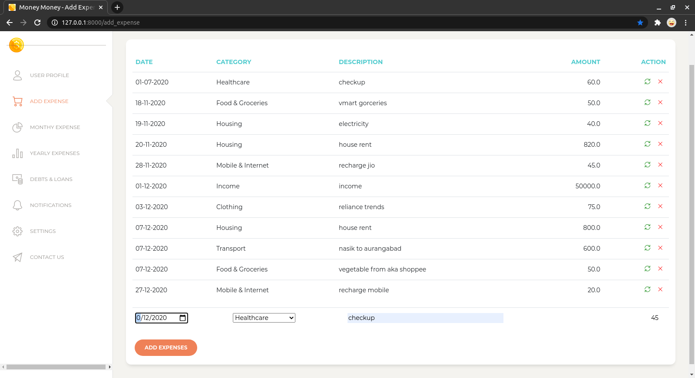
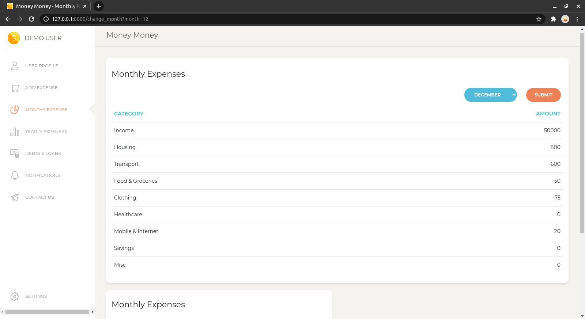
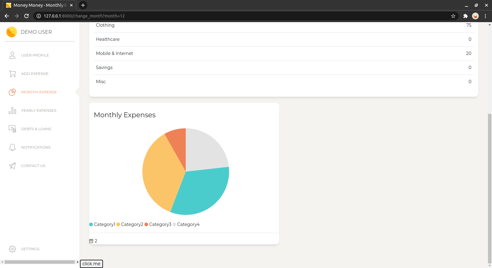
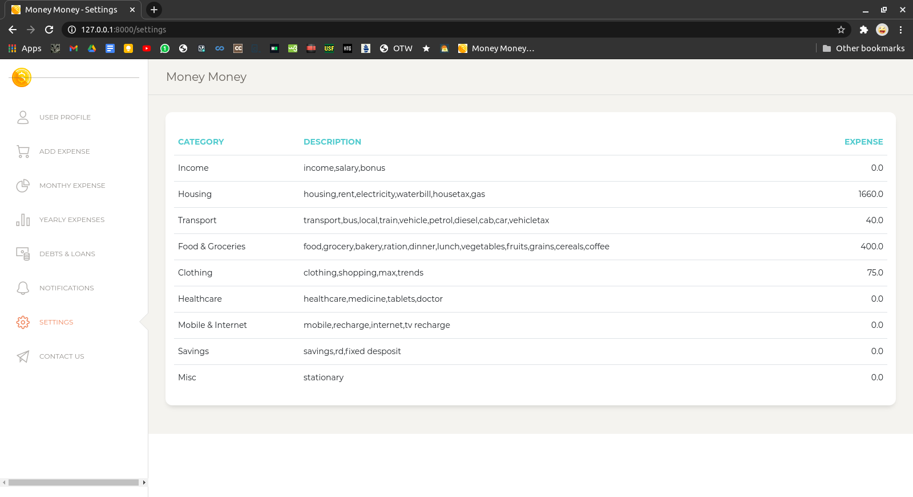
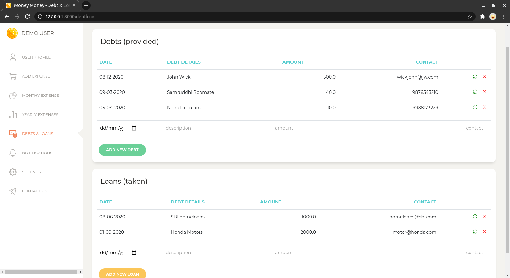
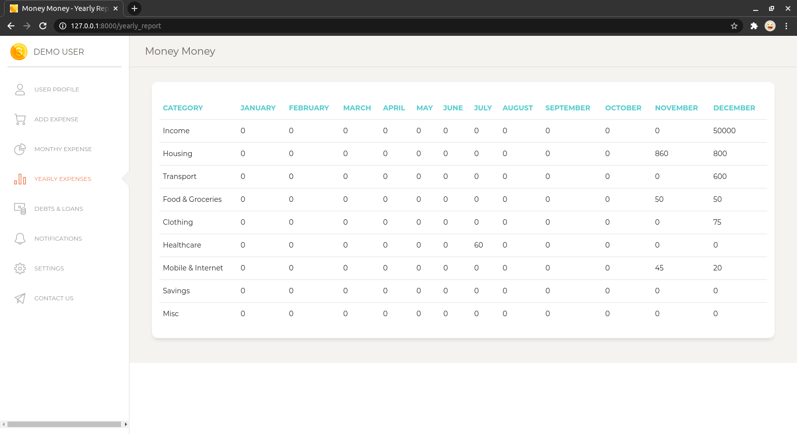

