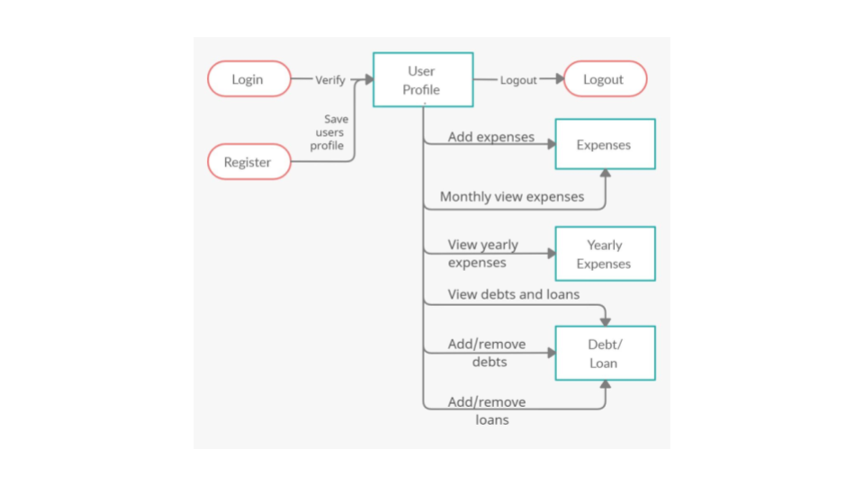

# Expense Tracking Application

This web application created using Dango Framework is an application to help individuals track their expenses with insightful visualizations. 
It uses of the MVT (Model View Template) architecture of Django framework. For the frontend, it uses HTML, CSS, and Javascript; and SQLite for database.

1). UML Diagram

